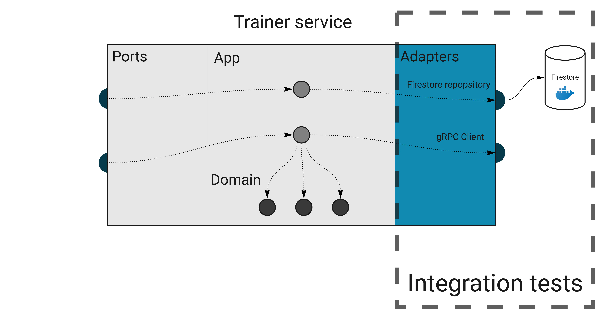

## Domain

Build a Task Management API with role-based access, enabling two types of users: Employer and Employee.

1. Employee Role:

- View Assigned Tasks: An Employee can only view the tasks assigned to them.
- Task Status Update: An Employee can update the status of their tasks (e.g., "In Progress," "Completed").

2. Employer Role:

- Create and Assign Tasks: An Employer can create tasks and assign them to specific employees.
- View All Tasks with Filtering and Sorting:
  - Filter tasks by:
    - Assignee: View tasks assigned to a specific employee.
    - Status: View tasks based on status (e.g., "Pending," "In Progress," "Completed").
  - Sort tasks by:
    - Date: Sort tasks by creation date or due date.
    - Status: Sort tasks by task status to see active or completed tasks first.
- View Employee Task Summary: An Employer can view a list of all employees, each showing:
  - Total number of tasks assigned.
  - Number of tasks completed by each employee.

## Environtment

- Golang 1.23.5
- Docker, Docker Compose

## Setup

- Run `docker compose up -d` to boostrap all dependencies (Mysql)
- Run `go install github.com/oapi-codegen/oapi-codegen/v2/cmd/oapi-codegen@latest` to install `oapi-codegen` tool
- Run `go install github.com/rubenv/sql-migrate/...@latest` to install `sql-migrate` tool
- Run `make migration-up` to migrate the database schema
- Run `make test` to run all test cases
- Run `make start` to start server

## Clean Architecture

Our approach to Clean Architecture is two ideas combined: separating Ports and Adapters and limiting how code structures refer to each other.

- **An adapter is how your application talks to the external world**. You have to **adapt** your internal structures to what the external API expects. Think SQL queries, HTTP or gRPC clients, file readers and writers, Pub/Sub message publishers.
- **A port is an input to your application**, and the only way the external world can reach it. It could be an HTTP or gRPC server, a CLI command, or a Pub/Sub message subscriber.
- **The application logic** is a thin layer that “glues together” other layers. It’s also known as “use cases”. If you read this code and can’t tell what database it uses or what URL it calls, it’s a good sign. Sometimes it’s very short, and that’s fine. Think about it as an orchestrator.
- If you also follow Domain-Driven Design, you can introduce a **domain layer that holds just the business logic**.

### The Dependency Inversion Principle

A clear separation between ports, adapters, and application logic is useful by itself. Clean Architecture improves it further with Dependency Inversion.

The rule states that **outer layers (implementation details) can refer to inner layers (abstractions), but not the other way around**. The inner layers should instead depend on interfaces.

- The **Domain** knows nothing about other layers whatsoever. It contains pure business logic.
- The **Application** can import domain but knows nothing about outer layers. **It has no idea whether it’s being called by an HTTP request, a Pub/Sub handler, or a CLI command**.
- **Ports** can import inner layers. Ports are the entry points to the application, so they often execute application services or commands. However, they can’t directly access **Adapters**.
- **Adapters** can import inner layers. Usually, they will operate on types found in **Application** and **Domain**, for example, retrieving them from the database.

## Test Architecture

### Unit tests

The domain layer is where the most complex logic of your service lives. However, **the tests here should be some of the simplest to write and running super fast**. There are no external dependencies in the domain, so you don’t need any special infrastructure or mocks (except for really complex scenarios, but let’s leave that for now).

As a rule of thumb, you should aim for high test coverage in the domain layer. Make sure you test only the exported code (black-box testing). Adding the `_test` suffix to the package name is a great practice to enforce this.

The domain code is pure logic and straightforward to test, so it’s the best place to check all corner cases. Table-driven tests are especially great for this.

We leave the domain and enter the application layer. After introducing CQRS, we’ve split it further into Commands and Queries.

Depending on your project, there could be nothing to test or some complex scenarios to cover. Most of the time, especially in queries, this code just glues together other layers. Testing this doesn’t add any value. But if there’s any complex orchestration in commands, it’s another good case for unit tests.

### Integration tests

An integration test is a test that checks if an adapter works correctly with an external infrastructure.

These tests are not about checking whether the database works correctly, but whether you use it correctly (the integration part). It’s also an excellent way to verify if you know how to use the database internals, like handling transactions.

Because we need real infrastructure, integration tests are more challenging than unit tests to write and maintain. Usually, we can use docker-compose to spin up all dependencies.

### Keeping integration tests stable and fast

When dealing with network calls and databases, the test speed becomes super important. It’s crucial to run tests in parallel, which can be enabled in Go by calling `t.Parallel()`. **It seems simple to do, but we have to make sure our tests support this behavior.**

For example, consider this trivial test scenario:

- Check if the trainings collection is empty.
- Call repository method that adds a training.
- Check if there’s one training in the collection.

If another test uses the same collection, you will get random fails because of the race condition. Sometimes, the collection will contain more than one training we’ve just added.

The simplest way out of this is never to assert things like a list length, but check it for the exact thing we’re testing. For example, we could get all trainings, then iterate over the list to check if the expected ID is present.

Another approach is to isolate the tests somehow, so they can’t interfere with each other. For example, each test case can work within a unique user’s context (see component tests below).

of course, both patterns are more complex than a simple length assertion. When you stumble upon this issue for the first time, it may be tempting to give up and decide that “our integration tests don’t need to run in parallel”. Don’t do this. You will need to get creative sometimes, but it’s not that much effort in the end. In return, your integration tests will be stable and running as fast as unit tests.

If you find yourself creating a new database before each run, it’s another sign that you could rework tests to not interfere with each other.
